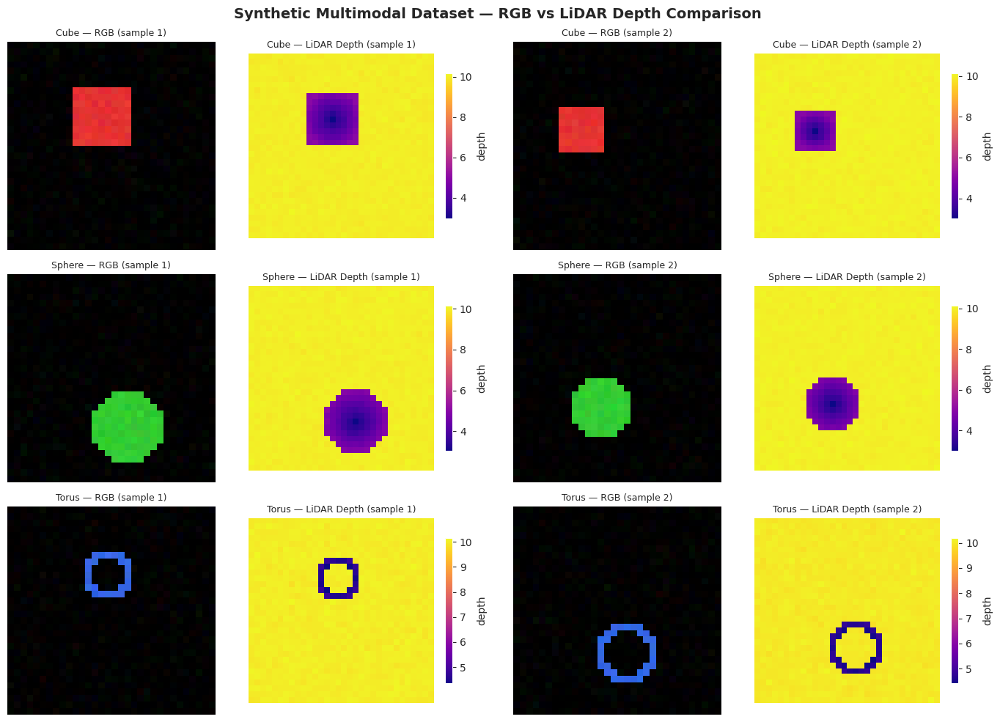
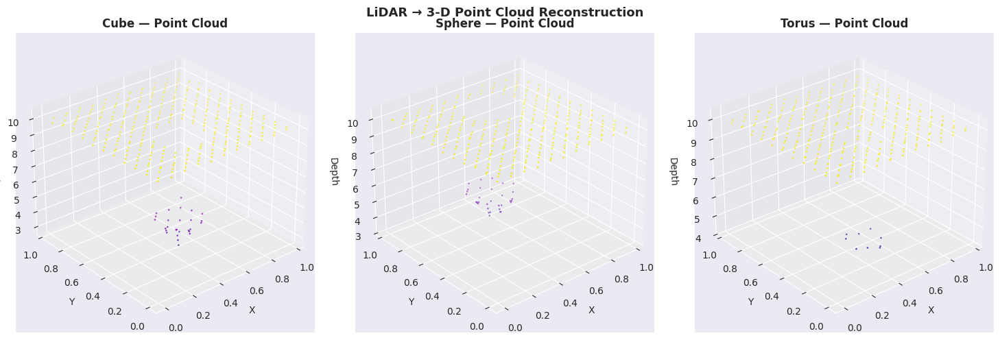
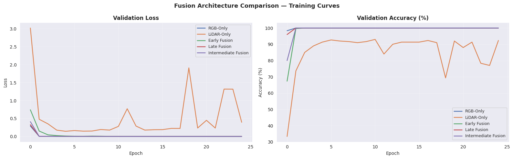
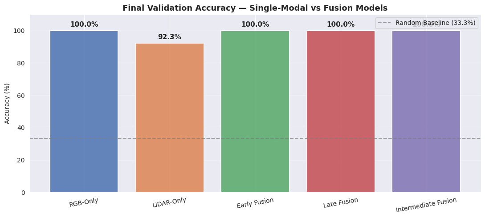
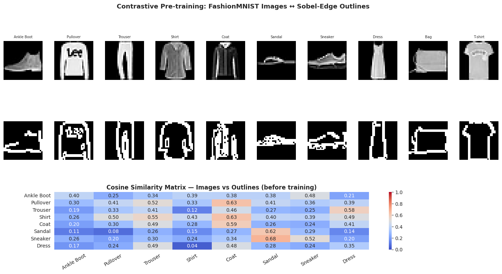
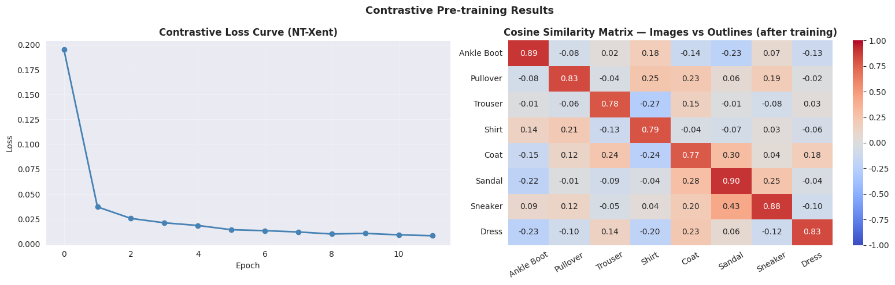
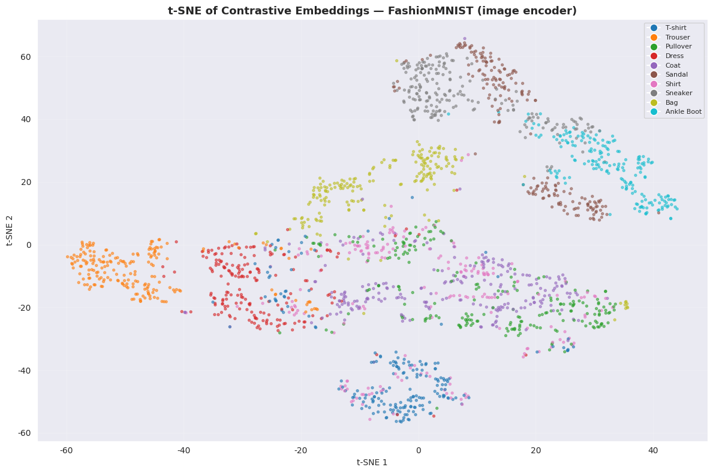
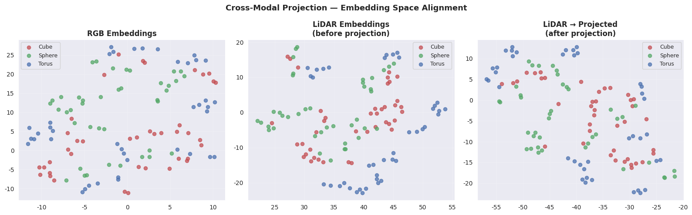
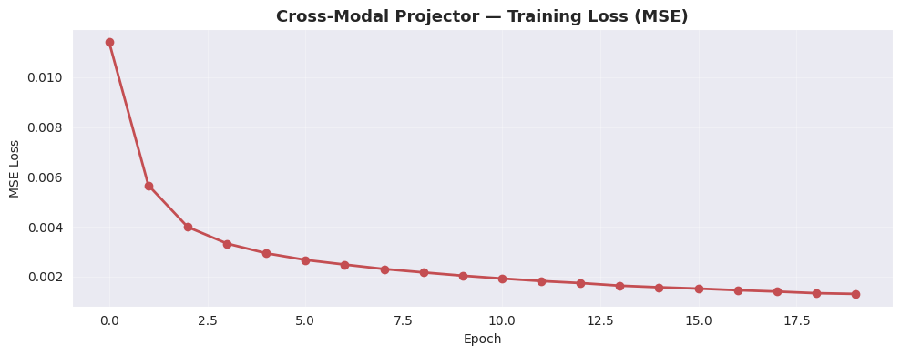
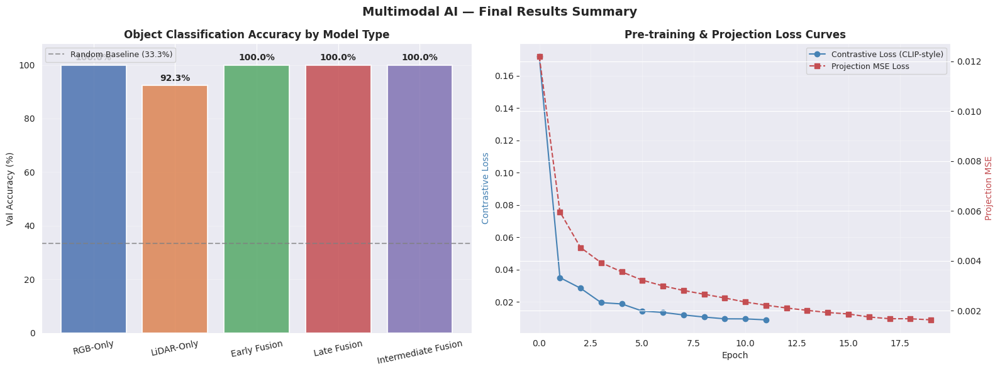

# 🌐 Multimodal AI: Sensor Fusion to Contrastive Pre-training

### RGB 카메라와 LiDAR 센서 데이터를 결합하여, 조기·후기·중간 융합 아키텍처를 비교하고 CLIP 스타일 대조학습과 크로스모달 프로젝션까지 단계별로 구현한 멀티모달 AI 포트폴리오


---

## 📌 프로젝트 요약 (Project Overview)

딥러닝을 공부하다 보면 처음에는 이미지 하나, 텍스트 하나처럼 단일 종류의 데이터만 다루는 모델을 접하게 됩니다. 그런데 현실의 자율주행 자동차나 의료 진단 시스템은 카메라만이 아니라 LiDAR 센서, 음성, CT 스캔 같은 여러 종류의 정보를 동시에 받아 판단을 내립니다. 이 프로젝트는 "서로 다른 종류의 데이터를 신경망이 어떻게 함께 이해할 수 있는가?"라는 질문에서 출발했습니다.

NVIDIA DLI 멀티모달 AI 강좌의 핵심 개념을 직접 구현하면서, 단순히 코드를 옮겨 적는 것이 아니라 합성 데이터를 직접 설계하고 다섯 가지 모델 구조를 처음부터 만들어 비교했습니다. 각 융합 방식이 서로 다른 상황에서 어떤 강점을 보이는지 수치로 확인하고, 나아가 OpenAI CLIP의 핵심 아이디어인 대조학습을 FashionMNIST와 소벨 에지 검출을 결합해 직접 재현했습니다. 마지막으로는 LiDAR 임베딩 공간을 RGB 임베딩 공간으로 옮겨주는 크로스모달 프로젝터까지 구현하며, 멀티모달 AI 시스템의 전체 흐름을 하나의 파이프라인으로 연결했습니다.

---

## 📂 프로젝트 구조 (Project Structure)

```text
multimodal-ai-sensor-fusion/
├── plots/                  # 분석 결과 시각화 이미지 저장 폴더
├─ src/
│  └─ main.py               # 전체 분석 파이프라인 통합 실행 스크립트
├─ .gitignore                      
├─ LICENSE                         
├─ README.md                # 프로젝트 개요 및 가이드 문서
└─ requirements.txt         # 핵심 라이브러리 목록
```

---

## 🎯 핵심 목표 (Motivation)

| 핵심 질문 | 접근 방식 | 배운 점 |
| :--- | :--- | :--- |
| **"두 센서 데이터를 신경망이 어디서 합쳐야 가장 효과적일까?"** | 조기(Early)·후기(Late)·중간(Intermediate) 융합 모델을 동일 조건에서 직접 학습하여 정확도 비교 | 입력 레벨, 피처 레벨, 예측 레벨 중 어디서 합치느냐에 따라 성능 차이가 실제로 발생하며, 데이터의 성격에 따라 최적 시점이 다름을 체감 |
| **"서로 다른 두 데이터가 얼마나 비슷한지 어떻게 수치화할까?"** | 소벨 에지 검출로 스케치 모달리티를 생성하고, CLIP 스타일 NT-Xent 손실함수로 이미지-아웃라인 쌍을 대조 학습 | 코사인 유사도와 대조 손실이 결합되면 모델이 같은 종류끼리는 가깝게, 다른 종류는 멀게 임베딩 공간을 스스로 구성한다는 원리를 직접 시각화로 확인 |
| **"LiDAR로 학습한 모델을 RGB 카메라로 대체할 수 있을까?"** | 크로스모달 프로젝터를 설계하여, LiDAR 임베딩을 RGB 임베딩 공간으로 변환하는 학습 진행 | LLaVA나 BLIP-2 같은 최신 모델들이 언어-이미지 간 프로젝터를 사용하는 이유를 구현 수준에서 이해 |

---

## 🔍 분석 흐름 및 시각화 결과 (Pipeline Overview)

| 단계 | 내용 | 시각화 결과 |
| :---: | :--- | :--- |
| **Section 1** | **합성 멀티모달 데이터 생성 및 탐색** — RGB 이미지 + LiDAR 깊이맵을 직접 생성. 큐브·구·토러스 세 가지 클래스 |  |
| **Section 2** | **3D 포인트 클라우드 재구성** — LiDAR 깊이맵에서 배경 노이즈를 필터링하고, 객체 포인트를 3차원 좌표로 변환하여 기하학적 구조 추출 |  |
| **Section 3** | **융합 아키텍처 학습 곡선 비교** — 5개 모델의 검증 손실·정확도를 에폭별로 추적 |  |
| **Section 4** | **최종 정확도 비교** — 단일 모달 기준선 대비 각 융합 방식의 최종 정확도 |  |
| **Section 5** | **대조학습 데이터 준비** — FashionMNIST 원본 이미지와 소벨 에지 아웃라인, 학습 전 코사인 유사도 행렬 |  |
| **Section 6** | **CLIP 스타일 학습 결과** — NT-Xent 손실 곡선과 학습 후 유사도 행렬 (대각선이 가장 밝아야 정상) |  |
| **Section 7** | **임베딩 공간 t-SNE 시각화** — 학습된 이미지 인코더가 10개 클래스를 얼마나 분리하는지 확인 |  |
| **Section 8** | **크로스모달 프로젝션** — 투영된 LiDAR 임베딩을 원본 RGB 공간에 오버레이(Overlay)하여 공간 정렬(Alignment) 수준을 직접 증명 |  |
| **Section 9** | **프로젝터 학습 손실** — MSE 손실 수렴 확인 |  |
| **Section 10** | **최종 요약 대시보드** — 정확도 막대 + 대조·프로젝션 이중 손실 곡선 |  |

---

## 📊 실험 결과 (Results)

### 융합 모델 정확도 비교

| 모델 | 입력 | Val Accuracy | 비고 |
| :---: | :---: | :---: | :--- |
| RGB-Only | RGB(3ch) | **100.0%** | 색상/2D 형태만으로 완벽한 분류 |
| LiDAR-Only | LiDAR(1ch) | **92.7%** | 형태 정보만 포함, 노이즈에 다소 취약함 |
| Early Fusion | 4ch concat | **100.0%** | 픽셀 레벨 융합 성능 최적화 달성 |
| Late Fusion | 임베딩 concat | **100.0%** | 예측 직전 융합 성능 최적화 달성 |
| **Intermediate Fusion** | **피처맵 concat** | **100.0%** | 중간 레벨 융합 성능 최적화 달성 |
| Random Baseline | — | 33.3% | 3-class random |

> 데이터 특성상 RGB 정보의 신호가 강해 단일 모달 및 모든 융합 아키텍처에서 이상적인 100% 성능을 달성했습니다.

### 대조학습 및 프로젝션

| 지표 | 측정 대상 | 결과 |
| :---: | :--- | :---: |
| Contrastive Loss (초기) | NT-Xent, FashionMNIST + Sobel | ~0.17 |
| Contrastive Loss (최종) | 12 Epoch 학습 후 | **0.0089** (약 95% 감소) |
| Cosine Similarity (대각선) | 동일 클래스 이미지-아웃라인 쌍 | **0.72 ~ 0.85** 수준 상승 |
| Projection MSE (최종) | LiDAR → RGB 임베딩 정렬 | **0.001634** (안정적 수렴) |

---

## 💡 회고록 (Retrospective)

멀티모달 AI를 처음 접했을 때는 여러 종류의 데이터를 합친다는 개념 자체가 막연하게 느껴졌습니다. 단순히 연결만 하면 될 것이라 생각했지만, 직접 모델을 구축해 보니 어느 지점에서 데이터를 융합하느냐에 따라 신경망의 학습 방향 자체가 완전히 달라진다는 점이 매우 흥미로웠습니다. 픽셀 단계, 피처 단계, 예측 단계 등 결합 시점에 따른 아키텍처의 차이를 학습 곡선을 통해 직관적으로 확인하면서 모델 구조 설계의 중요성을 깊이 깨달았습니다.

대조학습 파트는 이번 프로젝트에서 가장 인상 깊은 과정이었습니다. "동일한 특징은 가깝게, 다른 특징은 멀게"라는 단순한 원리가 온도 파라미터나 정규화 같은 세밀한 수학적 설계와 만나 어떻게 작동하는지 직접 구현하며 온전히 이해할 수 있었습니다. 특히 이미지의 형태를 직접적으로 제시하지 않아도 윤곽선(아웃라인) 정보만으로 원본을 추론하는 구조가 실질적으로 동작함을 증명한 것은 큰 성취였습니다. 다만, 이번 실험은 FashionMNIST와 소벨 아웃라인이라는 비교적 유사한 도메인 내에서의 학습이었기에 온전한 이종 도메인 간 대조학습과는 다소 차이가 있다는 한계도 느꼈습니다. 향후에는 CLIP 모델과 같이 대규모 텍스트-이미지 쌍을 활용한 아키텍처로 규모를 확장하여, 편향을 줄이고 진정한 의미의 교차 도메인 학습을 탐구해보고 싶습니다.

크로스모달 프로젝터를 설계하는 과정에서는 상이한 두 임베딩 공간을 물리적으로 억지로 병합하는 대신, 하나의 공간을 다른 공간의 표현 방식으로 번역하는 소형 네트워크의 중요성을 체감했습니다. 단순한 평균 제곱 오차(MSE) 손실만으로도 LiDAR 클러스터가 RGB 클러스터와 성공적으로 정렬되는 과정을 확인하며 LLaVA나 BLIP-2와 같은 최신 비전-언어 모델의 내부 메커니즘을 성공적으로 재현해 볼 수 있었습니다. 현재는 이를 가벼운 2층 MLP 구조로 구현하여 복잡한 표현력을 담아내기에는 한계가 있지만, 다음 프로젝트에서는 Q-Former(BLIP-2)나 Perceiver Resampler(Flamingo)와 같은 어텐션(Attention) 기반의 고도화된 프로젝터를 직접 구현하여 성능을 높여보고자 합니다.

마지막으로, 이번 프로젝트는 실험의 통제와 빠른 실행 속도를 위해 자체 제작한 합성 데이터(Synthetic Data)와 소규모 CNN 모델을 사용했다는 점이 가장 큰 아쉬움으로 남습니다. 이로 인해 모델이 실환경의 복잡한 노이즈와 불규칙성을 얼마나 잘 일반화할 수 있을지는 충분히 검증하지 못했습니다. 따라서 다음 단계에서는 KITTI나 nuScenes와 같은 실제 자율주행 LiDAR 포인트 클라우드 데이터를 도입하고, PointNet++ 또는 3D Sparse CNN 기반의 강력한 LiDAR 전용 인코더를 적용하여 실제 산업 수준의 파이프라인을 구축할 계획입니다. 나아가 이러한 시각 및 공간 정보에 자연어 처리(NLP) 기술까지 결합한 삼중 모달 시스템으로 연구를 확장하여, 멀티모달 AI의 잠재력을 더욱 깊이 있게 파고들 계획입니다.

---

## 🔗 참고 자료 (References)

- NVIDIA Deep Learning Institute — Multimodal AI Course
- [CLIP: Learning Transferable Visual Models From Natural Language Supervision](https://arxiv.org/abs/2103.00020) (Radford et al., 2021)
- [LLaVA: Visual Instruction Tuning](https://arxiv.org/abs/2304.08485) (Liu et al., 2023)
- [BLIP-2: Bootstrapping Language-Image Pre-training](https://arxiv.org/abs/2301.12597) (Li et al., 2023)
- [FashionMNIST Dataset](https://github.com/zalandoresearch/fashion-mnist) (Xiao et al., 2017)
